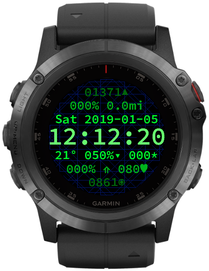

# ModText
A [Garmin ConnectIQ](http://developer.garmin.com/connect-iq) watch face.

## What?
This watch face builds for the Fenix 5x Plus. It's my first watch face
written with their awful, invented language.

## What does it look like?

## Fields
The field contents in order from top to bottom, left to right are:
- Altitude in default units
- % of Active Minutes Goal
- Distance Traveled
- Day of Week, Date in YYYY-MM-DD Format
- Local Time in HH:MM:SS (12 or 24 hour)
- Temperature in default units
- Battery Percentage, Charging Indicator Triangle, Notification Count
- % of Steps Goal, Activity Suggestion Icon, Heart Rate in Beats per
	Minute
- Barometric Pressure in default units

## Customization
None yet.

## Background
It's a graph of modular arithmetic.

## ToDo:
If I don't get burnt out dealing with:
- [sparse libraries](https://developer.garmin.com/downloads/connect-iq/monkey-c/doc/Toybox/Math.html) ,
- [inscrutiable decisions](https://developer.garmin.com/downloads/connect-iq/monkey-c/doc/Toybox/Lang.html#format) (why not re-use `sprintf`!?!?), and 
- [pathological pragmatism](https://developer.garmin.com/downloads/connect-iq/monkey-c/doc/Toybox/Time.html)
- [patronizing and condescending themes](https://developer.garmin.com/connect-iq/programmers-guide/monkey-c/)
- the myriad [monkey](https://developer.garmin.com/connect-iq/programmers-guide/shareable-libraries/) [metaphors](https://developer.garmin.com/connect-iq/programmers-guide/how-to-test/#runnoevil)

... I plan on adding:

- Color Theme Support
- Customizable Fields, Units, Formats, & Icons
- Weather Provider Support
- I18N
- Bluetooth Connection Indicator
- Build Support for Similarly Featured Round Watches
 
